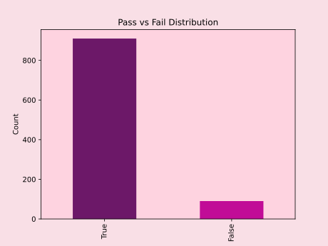
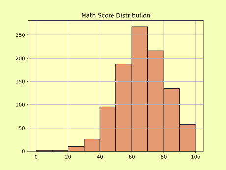
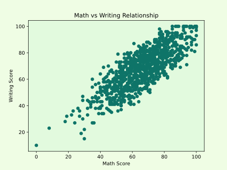
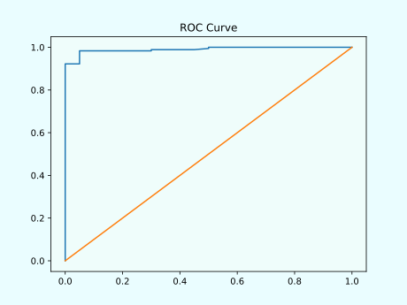
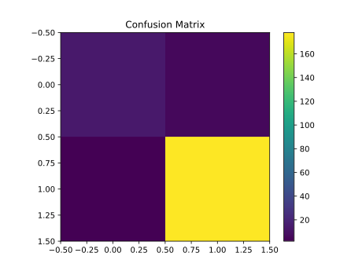

🎓 **Student Pass/Fail Prediction**
---

<aside>

A clean, modular ML project that predicts whether a student will *Pass* ✅ or *Fail* ❌ Reading.

</aside>


## 🎑 Project Overview

This project predicts whether a student will Pass or Fail based on academic performance data. The model uses Logistic Regression to classify outcomes using math and writing scores, with an optional gender feature.


## ✨ Why this project exists

A lot of ML demos stop at “trained a model.” This one goes further:

- 🧩 **Reusable pipeline** (load → preprocess → train → evaluate → visualize → save → predict)
- 📊 **Readable reports** (confusion matrix, ROC curve, probability distributions)
- 🖥️ **CLI-first experience** so anyone can run it locally

---

## 🎯 What it predicts

- **Target:** Pass ✅ / Fail ❌
- **Rule (labeling):** *Reading score ≥ 50 → Pass*, otherwise Fail
- **Inputs (features):**
    - ➕ Math score
    - ✍️ Writing score
    - 🧑‍🤝‍🧑 Optional: gender

---

## 🗺️ Workflow at a glance

```
[ Load Data ] → [ Preprocess ] → [ Train ] → [ Evaluate ] → [ Visualize ] → [ Save ] → [ Predict ]
```

```
CSV → Feature Engineering → Train/Test Split → Logistic Regression → Metrics → Charts → Model (.pkl) → CLI
```

---

## 🧱 Project structure

```
Student_Pass_Fail_Prediction
│
├── Data
│   └── StudentsPerformance_cleaned.csv
│
├── models
│   └── reading_model.pkl
│
├── reports
│   ├── Math_distribution.svg
│   ├── Pass_Fail_chart.svg
│   ├── Probability.svg
│   ├── ROC_curve.svg
│   ├── Scatter_chart.svg
│   ├── confusion_matrix.png
│   └── confusion_matrix.svg
│
├── src
│   ├── charts.py
│   ├── evaluate.py
│   ├── loader.py
│   ├── main.py
│   ├── preprocess.py
│   └── train.py
│
├── requirements.txt
└── structure.txt
```

---

## ⚡ Quickstart

### 1) 📥 Clone

```bash
git clone https://github.com/Atharv-AC/machine-learning-projects.git
cd Student_Pass_Classification
```

### 2) 🧪 Create & activate a virtual environment

```bash
python -m venv venv
source venv/bin/activate      # macOS/Linux
venv\Scripts\activate         # Windows
```

### 3) 📦 Install dependencies

```bash
pip install -r requirements.txt
```

---

## ▶️ Run the app 

```bash
python src/main.py
```

Menu options:

```
1. Load Data
2. Load Saved Model
3. Preprocess Data
4. Train Model
5. Evaluate Data
6. Save Model
7. Plot Confusion Matrix
8. Predict Pass/Fail
9. Predict Pass/Fail with Gender
10. Charts
11. Exit
```

Suggested run order:

```
1 → 3 → 4 → 5 → 7 → 10 → 6 → 8
```

---

## 🧠 Model & evaluation

**Model:** Logistic Regression 🟢

**Metrics you’ll see:**

- 🎯 Accuracy
- 🧩 Confusion matrix
- 🧾 Classification report
- 📈 ROC curve

<aside>
📌

**Note**

Exact metric values vary by train/test split.

</aside>

---

## 🖼️ Visual outputs

Charts and figures are saved to:

```
reports/
```


## Results

### Pass/Fail Distribution



### Math Distribution




### Scatter Chart




### ROC Curve




### Confusion Matrix



---

## 🚀 Learning Future and improvements

- 🧪 learned new concepts ROC curve, confusion matrix, accuracy score,etc
- 🧰 logistic regression, correlation matrix.
- 🛠️ Building teaches more than any tutorial.
- 🧑‍💻 Streamlit dashboard for interactive exploration
- 🌐 Learned Binary conversion of data.

---

## 👨‍💻 Author

**Atharv**

GitHub: https://github.com/Atharv-AC

## 🤝 Contributing

Contributions are welcome! Feel free to:

- Report bugs
- Suggest new features
- Submit pull requests


## 📜 License

This project is available for educational purposes.

---

*For questions or support, please open an issue in the repository.*
