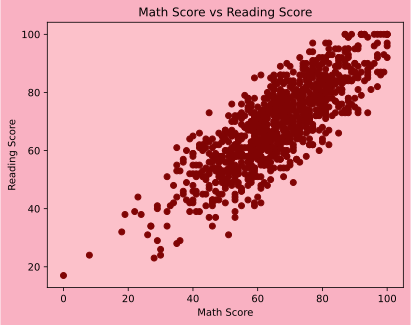
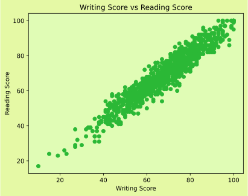
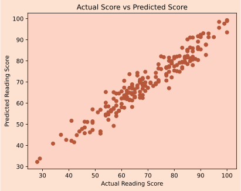
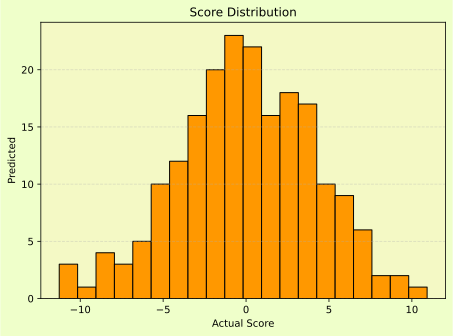

## 📚 Students Mark Prediction

A modular **Machine Learning pipeline** that predicts **students’ reading scores** from **math** and **writing** scores using **Linear Regression**.

<aside>

🎯 
**Goal**

Predict *Reading Score* using two features:

- **Math Score**
- **Writing Score**
</aside>

---

## ✨ Project Overview

This project focuses on predicting a student’s reading score using math and writing scores. The objective is to demonstrate a complete machine learning regression workflow using a structured and modular pipeline.

The system loads student performance data, preprocesses it, trains a Linear Regression model, evaluates performance using standard regression metrics, and generates visualizations to better understand relationships between variables and prediction accuracy.

---

## 🧩 Key Features

- ✅ Clean, modular architecture
- 📈 Linear Regression model
- 🧪 Evaluation with **MAE** and **R²**
- 📊 Visualization charts (saved to `reports/`)
- 💾 Save and load trained model
- 🖥️ Interactive command-line interface (CLI)
- 🗂️ Organized folder structure

---

## 🔁 Pipeline (Workflow)

```
[ Load Data ] → [ Preprocess ] → [ Train Model ] → [ Evaluate ] → [ Visualize ] → [ Save Model ] → [ Predict ]
```

**Pipeline flow:**

```
CSV → Pandas → Train/Test Split → Linear Regression → Metrics → Charts → Saved Model → User Input Prediction
```

---

## 🗂️ Project Structure

```
Students_mark_prediction
│
├── Data
│   └── StudentsPerformance_cleaned.csv
│
├── models
│   └── reading_model.pkl
│
├── reports
│   ├── ActualPred_corelation.svg
│   ├── HistrogramChart.svg
│   ├── MathRead_corelation.svg
│   ├── ResidualChart.svg
│   └── writeRead_corelation.svg
│
├── src
│   ├── charts.py
│   ├── evaluate.py
│   ├── loader.py
│   ├── main.py
│   ├── preprocess.py
│   └── train.py
│
└── structure.txt
```

---

## ⚙️ Installation

### 1) Clone the repository

```bash
git clone https://github.com/Atharv-AC/machine-learning-projects.git
cd Students_mark_prediction
```

### 2) Create a virtual environment

```bash
python -m venv venv
source venv/bin/activate      # Mac/Linux
venv\Scripts\activate         # Windows
```

### 3) Install dependencies

```bash
pip install pandas scikit-learn matplotlib joblib
```
or 
```
pip install -r requirements.txt
```

---

## 🚀 Usage

Run the application:

```bash
python src/main.py
```

**Menu options:**

```
1. Load Data
2. Load Saved Model
3. Preprocess Data
4. Train Model
5. Evaluate Data
6. Plot Data
7. Save Model
8. Predict Reading Score
9. Exit
```

**Recommended order:**

```
1 → 3 → 4 → 5 → 6 → 7 → 8
```

---

## 🧠 Model Information

- **Algorithm:** Linear Regression
- **Features:**
    - Math Score
    - Writing Score
- **Target:**
    - Reading Score
- **Evaluation Metrics:**
    - Mean Absolute Error (MAE)
    - R² Score

---
## 📌 Example Performance

| Metric | Description |
| --- | --- |
| MAE | Average prediction error |
| R² Score | Model goodness of fit |

---

## 📊 Visualizations

The system generates the following charts:

- 📉 Math vs Reading correlation
- 📉 Writing vs Reading correlation
- 🧾 Actual vs Predicted comparison
- 🧩 Residual plot
- 📊 Histogram distribution

Charts are saved automatically in:

```
reports/
```

---

## 🖼️ Results (Screenshots)

After running the project, your charts will appear here:


## Results

### Math vs Reading Correlation


### Writing vs Reading Correlation


### Actual vs Predicted


### Residual Plot


### Histogram



---

## 🚀 Learning and Future improvements

- 🧪 learn new topics Residuals, MAE, Varience,etc.
- 🧰 learn how to save and load that model.
- 🛠️ Building teaches more than any tutorials.
- 🧑‍💻 Streamlit dashboard for interactive exploration.
- 🌐 New charts plotted.

---

## 👨‍💻 Author

**Atharv Chandurkar**

GitHub: [https://github.com/Atharv-AC](https://github.com/your-username)

## 🤝 Contributing

Contributions are welcome! Feel free to:

- Report bugs
- Suggest new features
- Submit pull requests


## 📜 License

This project is available for educational purposes.

---

*For questions or support, please open an issue in the repository.*
